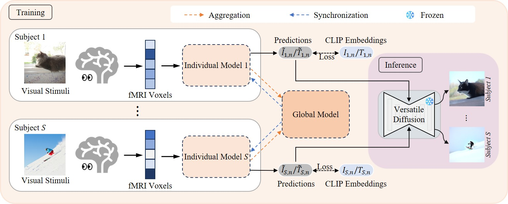

# BrainGuard: Privacy-Preserving Multisubject Image Reconstructions from Brain Activities [arXiv](https://arxiv.org/abs/2501.14309)

[Zhibo Tian](https://scholar.google.com/citations?user=HbKGBGgAAAAJ&hl=en), [Ruijie Quan](https://scholar.google.com/citations?user=WKLRPsAAAAAJ&hl=en), [Fan Ma](https://scholar.google.com/citations?user=FyglsaAAAAAJ&hl=en), [Kun Zhan](https://scholar.google.com/citations?user=sk7TcGAAAAAJ&hl=en), [Yi Yang](https://scholar.google.com/citations?hl=en&user=RMSuNFwAAAAJ)

## Overview


Reconstructing perceived images from human brain activity forms a crucial link between human and machine learning through Brain-Computer Interfaces. Early methods primarily focused on training separate models for each individual to account for individual variability in brain activity, overlooking valuable cross-subject commonalities. Recent advancements have explored multisubject methods, but these approaches face significant challenges, particularly in data privacy and effectively managing individual variability. To overcome these challenges, we introduce BrainGuard, a privacy-preserving collaborative training framework designed to enhance image reconstruction from multisubject fMRI data while safeguarding individual privacy. BrainGuard employs a collaborative global-local architecture where individual models are trained on each subject’s local data and operate in conjunction with a shared global model that captures and leverages cross-subject patterns. This architecture eliminates the need to aggregate fMRI data across subjects, thereby ensuring privacy preservation. To tackle the complexity of fMRI data, BrainGuard integrates a hybrid synchronization strategy, enabling individual models to dynamically incorporate parameters from the global model. By establishing a secure and collaborative training environment, BrainGuard not only protects sensitive brain data but also improves the image reconstructions accuracy. Extensive experiments demonstrate that BrainGuard sets a new benchmark in both high-level and low-level metrics, advancing the state-of-the-art in brain decoding through its innovative design.

## Installation

1. Agree to the Natural Scenes Dataset's [Terms and Conditions](https://cvnlab.slite.page/p/IB6BSeW_7o/Terms-and-Conditions) and fill out the [NSD Data Access form](https://forms.gle/xue2bCdM9LaFNMeb7)

2. Clone this repository: ``git clone https://github.com/kunzhan/BrainGuard.git``

3. Create a conda environment and install the packages necessary to run the code.

```bash
conda create -n brainguard python=3.10.8 -y
conda activate brainguard
pip install -r requirements.txt
```

## Preparation

Download the essential files we used from [NSD dataset](https://natural-scenes-dataset.s3.amazonaws.com/index.html), which contains `nsd_stim_info_merged.csv`, `captions_train2017.json` and `captions_val2017.json`.
We use the same preprocessed data as [MindEye's](https://github.com/MedARC-AI/fMRI-reconstruction-NSD), which can be downloaded from [Hugging Face](https://huggingface.co/datasets/pscotti/naturalscenesdataset/tree/main/webdataset_avg_split), and extract all files from the compressed tar files.
Then organize the data as following:

<details>

<summary>Data Organization</summary>

```
data/natural-scenes-dataset
├── nsddata
│   └── experiments
│       └── nsd
│           └── nsd_stim_info_merged.csv
├── nsddata_stimuli
│   └── stimuli
│       └── nsd
│           └── annotations
│              ├── captions_train2017.json
│              └── captions_val2017.json
└── webdataset_avg_split
    ├── test
    │   ├── subj01
    │   │   ├── sample000000349.coco73k.npy
    │   │   ├── sample000000349.jpg
    │   │   ├── sample000000349.nsdgeneral.npy
    │   │   └── ...
    │   └── ...
    ├── train
    │   ├── subj01
    │   │   ├── sample000000300.coco73k.npy
    │   │   ├── sample000000300.jpg
    │   │   ├── sample000000300.nsdgeneral.npy
    │   │   └── ...
    │   └── ...
    └── val
        ├── subj01
        │   ├── sample000000000.coco73k.npy
        │   ├── sample000000000.jpg
        │   ├── sample000000000.nsdgeneral.npy
        │   └── ...
        └── ...
```
</details>

### Checkpoints
You can download our pretrained Brainguard checkpoints for "subject01, 02, 05, 07" from [Hugging Face](https://huggingface.co/Zhibo2333/Brainguard/tree/main). And place the folders containing checkpoints under the directory `./train_logs/`.

## Training 

```bash
bash scripts/train.sh
```

## Citation
```
@InProceedings{tian2025brainguard,
  author    = {Zhibo Tian and Ruijie Quan and Fan Ma and Kun Zhan and Yi Yang},
  booktitle = {AAAI},
  title     = {{BrainGuard}: Privacy-preserving multisubject image reconstructions from brain activities},
  year      = {2025},
  volume    = {39},
}
```

## Acknowledgement
We extend our gratitude to [MindBridge](https://github.com/littlepure2333/MindBridge), [MindEye](https://github.com/MedARC-AI/fMRI-reconstruction-NSD) and [nsd_access](https://github.com/tknapen/nsd_access) for generously sharing their codebase, upon which ours is built. We are indebted to the [NSD dataset](https://natural-scenes-dataset.s3.amazonaws.com/index.html) for providing access to high-quality, publicly available data.

## Contact
https://kunzhan.github.io/

If you have any questions, feel free to contact me. (Email: `ice.echo#gmail.com`)